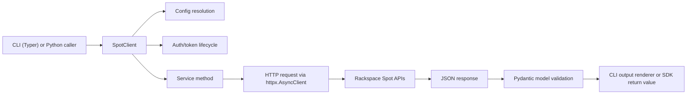

This page explains the runtime flow from CLI/SDK input to typed service responses.

## Runtime Data Flow

## Config Resolution Path

`SpotClient.__init__` resolves settings in layered order:

1. Explicit constructor args
2. `RuntimeSettings` environment aliases
3. Selected profile from `ProfileManager`
4. Constants defaults

Profile selection path:
- explicit `profile`
- env profile (`RSSPOT_PROFILE`/`SPOT_PROFILE`)
- config `active_profile`
- fallback `default`

## Auth and Token Refresh Path

- `authenticate()` reuses current `id_token` while unexpired (JWT `exp` with skew window)
- On missing/expired token, client exchanges `refresh_token` at `<oauth_url>/oauth/token`
- `_request_json()` retries once with forced refresh on `401`/`403`

## Request/Retry Model

- Transport: `httpx.AsyncClient` with configured timeout and TLS verification
- Transient retries: `429` and `5xx`
- Retry count: `max_retries + 1` attempts
- Backoff: exponential using `retry_backoff_factor`
- Failure types:
  - `APIError` for non-success HTTP responses
  - `RequestError` for transport/JSON-shape issues

## Caching Model

Two cache layers exist:

1. Process-level singleton cache (`get_client`) keyed by `(config_file, profile)`
2. In-client org resolution cache (`name <-> org-id`) to avoid repeated org lookup calls

Use `aclose_all_clients()` on shutdown for long-lived processes.

## Where To Extend

- Add new API domains in `src/rsspot/services/*`
- Introduce response/request models in `src/rsspot/models/*`
- Expose new CLI workflows in `src/rsspot/cli.py`

Detailed module maps are in [rsspot internals](/modules/rsspot).
