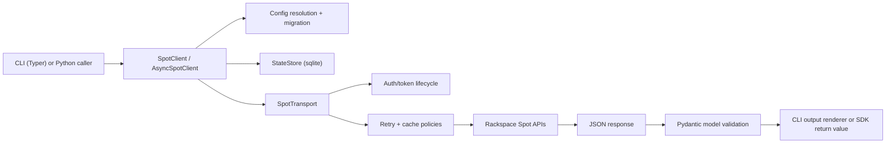

This page explains runtime flow from CLI/SDK input to typed service responses and persisted runtime state.

## Runtime Data Flow

## Package Layout

- `src/rsspot/client`
  - `async_client.py`: async core runtime
  - `sync_client.py`: unified sync/async wrapper
  - `singleton.py`: global configure/singleton/context helpers
- `src/rsspot/config`
  - model definitions, loader precedence, legacy migration
- `src/rsspot/state`
  - sqlite-backed preferences/cache/history/registration ledger
- `src/rsspot/http`
  - transport, retry policy, cache policy
- `src/rsspot/services`
  - typed API domain facades
- `src/rsspot/workflows`
  - VM registration orchestration primitives

## Config and State Resolution

Config path resolution:
1. Runtime config dict/model
2. Explicit `config_path`
3. Env path (`RSSPOT_CONFIG*`)
4. Default `~/.config/rsspot/config.*`
5. Legacy `~/.spot_config` migration fallback

State path resolution:
1. Explicit `state_path`
2. Config `state_path`
3. `<resolved-config-dir>/state.db`
4. `~/.config/rsspot/state.db` fallback

## Unified Client Contract

`SpotClient` provides:
- sync grouped APIs: `organizations`, `regions`, `server_classes`, `pricing`, `cloudspaces`, `spot_nodepools`, `ondemand_nodepools`, `inventory`
- async grouped APIs with `a` prefix: `aorganizations`, `aregions`, ...

Constraint:
- Sync methods raise a runtime error when called inside an active event loop.

## Retry, Auth, and Cache Model

- Auth token lifecycle:
  - reuse valid id token
  - refresh via `POST <oauth_url>/oauth/token` when needed
- Retry policy:
  - status- and exception-based retries with jittered backoff
- Cache policy:
  - GET-only caching by default
  - in-memory front cache + sqlite backend
  - mutation-triggered invalidation by API path prefix

## Persistent State Schema

`state.db` tables:
- `preferences`
- `http_cache`
- `command_history`
- `registration_ledger`

## Extension Points

1. Add endpoint coverage:
- add/extend method in `services/*`
- add model in `models/*`
- expose CLI command where needed

2. Tune runtime behavior:
- retry/cache defaults in config models
- env aliases in `settings.py`

3. Compose registration automation:
- use `RegistrationWorkflow` + `StateStore`
- orchestrate external Omni integration without direct dependency
